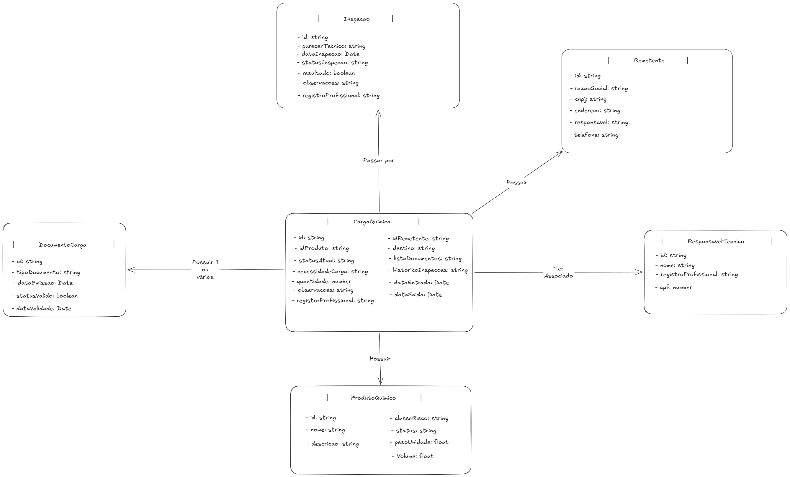
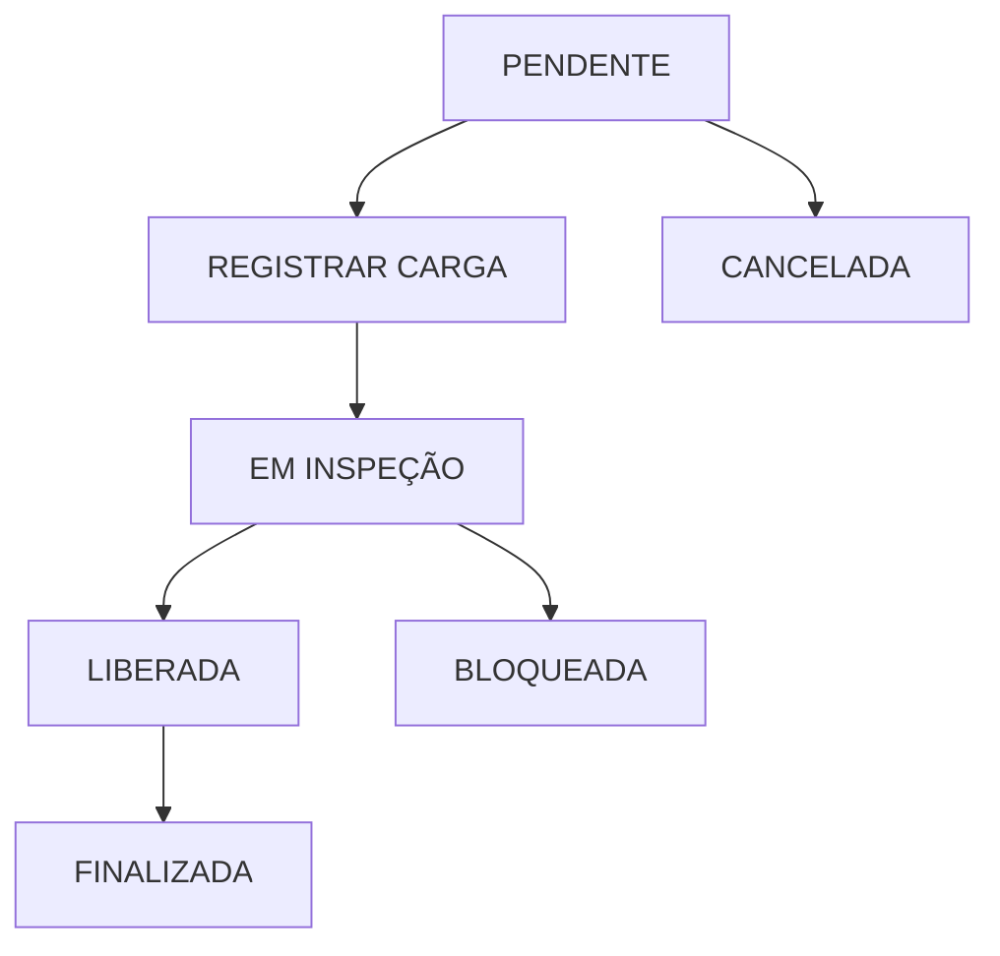

# FIAP QuimiPort - Tech Challenge (Fase 1)

  

## 1. Entendimento do Domínio

**Contexto de Problema:** O Porto de Santos é um dos principais pontos de movimentação do Brasil, lidando com produtos químicos que exigem controle cuidadoso, acompanhamento técnico, documentação adequada e classificação de risco. Atualmente, o registro em empresas de controle é feito de forma manual ou descentralizada. Isso dificulta a consulta das informações, o rastreio do status da carga e a validação de regras de segurança essenciais.

  

**Resolução de problema:** O **QuimiPort** surge para solucionar esse cenário, oferecendo um sistema centralizado para a gestão inicial dessas cargas, bloqueando ou liberando as operações de acordo com as regras de negócio.

  

**Usuários Envolvidos:** O ecossistema engloba os seguintes atores:

* **Operador portuário:** Atua no registro e na linha de frente da movimentação.

* **Responsável técnico:** Profissional que atesta as cargas.

* **Analista de documentação:** Encarregado de inserir e validar os documentos.

* **Analista de qualidade:** Responsável por avaliações e inspeções na carga.

* **Gestor operacional:** Supervisiona as cargas e o fluxo portuário.

* **Administrador do sistema:** Gerencia os cadastros primários de produtos, usuários e verifica possíveis erros.

  

**Informações Controladas:** Para que o controle seja efetivo, o sistema precisa gerenciar:

* Cadastro de produtos e suas respectivas classes de risco.

* Cadastro de documentação de produtos se obrigatório.

* Documentação obrigatória vinculada a cada carga.

* Dados do responsável técnico pela carga.

* Status de andamento e histórico da carga.

* Cadastro das necessidades da carga (refrigerada, frágil, etc.).

  

**Processos da Operação e Decisões:** O fluxo operacional envolve cadastrar os produtos químicos de referência, registrar a entrada das cargas físicas, associá-las aos responsáveis, anexar a documentação (caso obrigatório) e se necessário solicitar inspeções. O sistema atua como o tomador de decisão primário para **liberar ou bloquear** a movimentação de uma carga, validando de forma automatizada se todos os requisitos de segurança e documentais foram cumpridos para seguir até a etapa final.

  

---

  
## 2. Modelagem com Domain Driven Design (DDD)

Para garantir que a complexidade do ecossistema portuário seja bem traduzida para o código, utilizamos os conceitos de DDD. Esta abordagem permite que as regras de negócio fiquem isoladas e protegidas no núcleo da aplicação.

### Linguagem Ubíqua

* **Produto Químico:** O material de referência cadastrado no sistema (o catálogo). Representa as especificações do produto, e não o contêiner físico.

* **Carga Química:** Lote físico e fechado do produto químico que chega ao porto e precisa ser movimentado.

* **Responsável Técnico:** Profissional legalmente capacitado que atesta a conformidade de uma carga.

* **Documentação:** Conjunto de registros e licenças exigidos para atestar a legalidade e a segurança da carga.

* **Carga Retida:** Status temporário indicando que a carga está aguardando alguma aprovação, seja de teste de qualidade ou liberação de documentação.

* **Inspeção:** Processo de avaliação física ou documental realizado pela equipe de qualidade (analistas).

* **Status da Carga:** O estado atual da carga dentro do fluxo portuário (ex: CADASTRADA, EM_INSPECAO, BLOQUEADA, LIBERADA, CANCELADA).

* **Risco da Carga:** Classificação de risco que compõe o material (ex: Explosivos, Gases, Líquidos Inflamáveis, Sólidos Inflamáveis).

* **Necessidade da Carga:** Necessidade especial para transporte e armazenamento (ex: Nenhuma, Refrigeração Contínua, Isolamento Térmico, Armazenamento Estritamente Seco, Acolchoamento/Anti-vibração).

* **Remetente:** Cliente (empresa) de origem que está enviando a carga química para o porto.


### Objetos de Valor

* **QuantidadeMedida:** Representa o volume ou peso físico da carga. *Regra:* É composto por um `valor` (estritamente maior que zero) e uma `unidade`. Não permite a criação de medidas negativas.

* **ClassificacaoRisco:** Representa a categoria de perigo do material. *Regra:* Deve ser um valor estrito e válido dentro de uma lista padronizada (Enum).

* **NecessidadeCarga:** Representa as condições rigorosas de transporte (ex: Refrigeração Contínua).

* **CNPJ:** Representa a identificação fiscal de um Remetente. *Regra:* Valida matematicamente os dígitos verificadores e aplica a formatação padrão.

* **Endereco:** Agrupa os dados de localização física do remetente (Logradouro, Número, Cidade, Estado, CEP).

* **Telefone:** Representa o contato do remetente, validando código de área e formato.


### Entidades

**1. Produto Químico**

* **Responsabilidade:** Representar o catálogo base de materiais, guardando suas propriedades químicas e de segurança.

* **Atributos:** `id`, `nome`, `classeRisco`, `status`, `descricao`, `pesoUnidade`.


**2. Carga Química**

* **Responsabilidade:** Rastrear o lote físico do material que chega ao porto, gerenciar a transição de seus status e proteger as regras de movimentação.

* **Atributos:** `id`, `idProduto`, `quantidade`, `necessidadeCarga`, `statusAtual`, `observacoes`, `registroProfissional`, `idRemetente`, `destino`, `listaDocumentos`, `historicoInspecoes`, `dataEntrada`, `dataSaida`.
  

**3. Responsável Técnico**

* **Responsabilidade:** Identificar o profissional que responde legalmente pelo status da carga.

* **Atributos:** `id`, `nome`, `registroProfissional`, `cpf`.


**4. Documento da Carga**

* **Responsabilidade:** Comprovar o pertencimento legal e de segurança.

* **Atributos:** `id`, `tipoDocumento`, `dataEmissao`, `statusValido`, `dataValidade`.


**5. Inspeção**

* **Responsabilidade:** Registrar o histórico de avaliações da equipe de qualidade.

* **Atributos:** `id`, `dataInspecao`, `resultado`, `observacoes`, `registroProfissional`, `parecerTecnico`, `statusInspecao`.


**6. Remetente (Empresa Cliente)**

* **Responsabilidade:** Representar a empresa de origem que está enviando a carga química.

* **Atributos:** `id`, `razaoSocial`, `cnpj`, `endereco`, `responsavel`, `telefone`.


### Agregado Principal: Carga Química

* **Responsabilidade:** Atuar como a *Root Entity* e estabelecer a fronteira de consistência transacional do sistema. A Carga Química orquestra todo o ciclo de vida do lote no porto, garantindo que o sistema nunca entre em um estado inválido.

* **Composição:** A raiz engloba propriedades (`quantidade`, `necessidadeCarga`, `statusAtual`), referências externas (`idProduto`, `registroProfissional`, `idRemetente`) e é "dona" das coleções internas (`listaDocumentos`, `historicoInspecoes`).

* **Regras Protegidas:** Impede criação de carga órfã; trava liberação sem documentos validados; trava movimentação com inspeção pendente; e orquestra a máquina de estados unidirecional.

  

---
  

## 3. Casos de Uso

* **CU01: Cadastrar Produto Químico:** Registra novo produto. Retorna `idProduto` ativo. Erro se faltar nome ou classe de risco (400).

* **CU02: Inativar Produto Químico:** Altera status para `ativo = false`, impedindo o uso em novas cargas.

* **CU03: Registrar Carga Química:** Recebe carga física. Gera `idCarga` com status `CADASTRADA`. Valida se o produto está ativo e se quantidade > 0.

* **CU04: Validar Documentação da Carga:** Anexa licenças obrigatórias validadas. A data de validade deve ser maior que a data atual.

* **CU05: Solicitar Inspeção:** Altera status para `EM_INSPECAO`. Apenas para cargas `CADASTRADAS`.

* **CU06: Liberar Carga Química:** Altera status para `LIBERADA`. Exige documentação aprovada e inspeções finalizadas.

* **CU07: Bloquear Carga Química:** Altera status para `BLOQUEADA`, interrompendo qualquer operação com a carga por irregularidades.

* **CU08: Atualizar Status da Carga:** Registra progresso (ex: `EM_MOVIMENTACAO` ou `CONCLUIDA`). Uma carga bloqueada não transita.

* **CU09: Cancelar Carga Química:** Status vai para `CANCELADA`. Cargas já concluídas não podem ser canceladas.

* **CU10: Consultar Cargas:** Lista e filtra cargas armazenadas com paginação.

* **CU11: Consultar Histórico da Carga:** Rastreabilidade em modo leitura (auditoria).


---


## 4. Regras de Negócio

As regras de domínio críticas que guiam o sistema QuimiPort:

* R1: Nenhuma carga pode ser registrada sem produto químico associado ou com produto inativo.

* R2: Um produto químico não pode ser cadastrado sem classe de risco.

* R3: A quantidade da carga deve ser obrigatoriamente maior que zero.

* R4: Toda carga deve possuir um responsável técnico informado.

* R5: Uma carga não pode ser movimentada sem a documentação obrigatória validada ou se possuir inspeção pendente.

* R6: Cargas com status `BLOQUEADA` ou `CANCELADA` não podem entrar em movimentação sob nenhuma hipótese.

- R7: usuários só podem liberar carga se tiverem perfil autorizado

- R8: credenciais inválidas devem bloquear login

- R9: perfil de operação e inspeção deve respeitar regras de acesso por função

- R10: Volume e peso de produto não pode exceder a limite de carga.

---


## 5. Arquitetura Proposta

Para o projeto QuimiPort, a arquitetura escolhida é a **Onion Architecture (Arquitetura em Cebola)**. Esta decisão garante uma forte separação de responsabilidades e permite que o sistema evolua de forma segura:

* **Domínio (Core):** Onde residem as regras de negócio puras (Entidades, Agregados, Enums). Não possui dependência externa.

* **Aplicação (Use Cases):** Orquestra o fluxo (ex: RegistrarCarga). Consome o domínio e define contratos.

* **Interface (Entrada):** Recebe requisições (API/Web), valida formatos e repassa para os Casos de Uso.

* **Infraestrutura:** Lida com o banco de dados e integrações externas implementando as interfaces da aplicação.

  

---

  

## 6. Organização do projeto 

| ARQUIVO                               |
| :------------------------------------ |
| `src`                                 |
| `src/domain`                          |
| `src/domain/entities`                 |
| `src/domain/repositories`             |
| `src/application`                     |
| `src/application/use-cases`           |
| `src/infrastructure`                  |
| `src/infrastructure/database`         |
| `src/infrastructure/http`             |
| `src/presentation/controllers`        |
| `tests`                               |


## 7. Diagrama



Link: "https://excalidraw.com/#json=Nn0gwi01JNOsn51lIkOx7,lmL7vKmiYS7rRguU0dWULw"


## 8. Planejamento de qualidade de software


O plano de qualidade do projeto **QuimiPort** tem como objetivo garantir que todas as regras de negócio, casos de uso e fluxos críticos do domínio sejam validados de forma consistente, segura e alinhada ao contexto portuário descrito no desafio. A seguir, apresentamos o conjunto completo de diretrizes que orientarão os testes nas próximas fases do desenvolvimento.

---

## Regras de negócio que precisam ser testadas

As regras de negócio são o núcleo do domínio e representam restrições essenciais para segurança, conformidade e operação. Entre as regras que devem obrigatoriamente ser testadas estão:

* Produto químico deve possuir **nome** e **classe de risco**.
* Produto químico **inativo** não pode ser utilizado em novas cargas.
* Carga química deve ter produto associado, ativo e com classificação de risco.
* Quantidade da carga deve ser **maior que zero**.
* Responsável técnico deve possuir **nome, CPF e registro profissional válidos**.
* Toda carga deve possuir responsável técnico informado.
* Carga química só pode ser liberada com a **documentação obrigatória validada**.
* Carga bloqueada não pode entrar em movimentação.
* Uma carga química **cancelada não pode ser liberada**.
* Carga em inspeção não pode ser finalizada sem liberação.
* Todas as **transições de status** devem ser validadas.

---

## Casos de uso mais críticos

Os casos de uso críticos são aqueles que envolvem maior risco operacional ou impacto direto na segurança da carga. Entre eles:

* **Cadastrar produto químico**
* **Registrar carga química**
* **Validar documentação**
* **Liberar carga química**
* **Atualizar status da carga**

Esses casos exigem testes mais completos, cobrindo cenários positivos e negativos.

---

## Tipos de teste que serão utilizados

Para garantir cobertura adequada, o projeto utilizará diferentes tipos de testes:

* **Testes unitários:** regras de negócio, funções puras, entidades e agregados.
* **Testes de integração:** casos de uso completos, interação entre camadas e persistência.
* **Testes de validação de dados:** campos obrigatórios, formatos e consistência.
* **Testes de comportamento:** regras proibitivas e cenários de exceção.
* **Testes com mocks e dados simulados:** substituição de dependências externas.
* **Testes de ciclo de vida da carga:** transições de status válidas e inválidas.
* **Testes de fluxo (E2E conceitual):** simulação de operações reais do domínio.

---

## Como o grupo pretende aplicar testes unitários

Os testes unitários serão aplicados diretamente sobre:

* Regras de negócio isoladas
* Funções puras de validação
* Casos de uso com dependências mockadas
* Cenários negativos e exceções
* Entidades e agregados
* Enums e objetos de valor

O foco é garantir que cada regra funcione corretamente sem infraestrutura externa.

---

## Como o grupo pretende aplicar testes de integração futuramente

Quando o backend estiver implementado, os testes de integração vão validar:

* Interação entre camadas da arquitetura
* Persistência real usando banco em memória ou containers
* Casos de uso completos com dados reais
* Regras que dependem de múltiplos componentes
* Fluxos completos do domínio *(registro → documentação → inspeção → liberação)*
* Cenários de erro com dados persistidos

---

## Como o grupo pretende validar fluxos principais

Os fluxos principais serão validados através de testes de integração e E2E conceitual, cobrindo:

* Fluxo completo de **liberação da carga**
* Fluxo de **bloqueio e impedimento de movimentação**
* Fluxo de **cancelamento**
* Fluxo de **inspeção**
* Fluxo de **transição de status**
* Fluxo de **documentação obrigatória:** anexar → validar → liberar

Cada fluxo será testado em cenários positivos e negativos, garantindo que o sistema respeite todas as regras do domínio.

---

## Como o grupo pretende organizar mocks e dados simulados

Para permitir testes sem backend, o grupo utilizará:

* Repositórios simulados em memória
* Mocks organizados por contexto (produto, carga, documentação, responsável técnico)
* Dados simulados representando situações reais do porto
* Simulação de erros e exceções
* Builders para criação de cenários complexos

## 9. Tecnologias e Conceitos


O sistema será construído utilizando **TypeScript** para garantir segurança tipada, previsibilidade e escalabilidade do código. Os conceitos de JavaScript Avançado serão aplicados da seguinte maneira para suportar a modelagem do Domínio:


*   **Classes e Orientação a Objetos:** Utilizadas para modelar o domínio central. Entidades como `CargaQuimica` esconderão seus atributos (encapsulamento privado) e exporão apenas métodos que protegem as regras de negócio (ex: o método `liberarCarga()` valida o estado antes de atualizá-lo).

*   **Interfaces (Contratos):** Serão fundamentais para aplicar a Inversão de Dependência. Criaremos interfaces como `ICargaRepository` na camada de Domínio, ditando o que o sistema precisa, enquanto a Infraestrutura se encarrega de implementar como isso será feito no banco de dados.

*   **Enums:** Aplicados para categorizar dados absolutos do contexto portuário, como status das cargas e classificações de risco de produtos químicos, evitando o uso de strings soltas e propensas a erros.

*   **Funções Puras:** Usadas intensamente nas validações internas (ex: validar se a quantidade da carga é maior que zero). Elas garantem que, para uma mesma entrada, a saída seja sempre idêntica, sem efeitos colaterais.

*   **Generics:** Empregados para evitar repetição de código, principalmente em retornos padronizados da API e na criação de repositórios base (ex: `IRepository<T>`).

*   **Módulos ES6+ e Async/Await:** A organização dos arquivos usará a sintaxe moderna de `import`/`export`. O `async/await` será o padrão nos contratos de repositórios e serviços, preparando as fundações para operações de rede e leituras de banco de dados que ocorrerão de forma assíncrona nas próximas fases.

*   **Tratamento de Erros:** Criaremos classes de erro customizadas estendendo a classe nativa `Error` (ex: `BusinessRuleError`). Isso garantirá respostas claras e padronizadas sempre que uma regra (como tentar movimentar carga bloqueada) for infringida.

### Exemplo Conceitual da Modelagem:
  

```typescript

// Enums protegendo valores padronizados

export enum StatusCarga {

  PENDENTE = 'PENDENTE',

  BLOQUEADA = 'BLOQUEADA',

  LIBERADA = 'LIBERADA',

}

  

// Interface (Contrato genérico)

export interface ICargaRepository<T> {

  salvar(entidade: T): Promise<void>;

}

  

// Classe de Domínio

export class CargaQuimica {

  private status: StatusCarga;

  

  constructor(

    private id: string,

    private produtoId: string,

    private quantidade: number

  ) {

    this.validarQuantidade(quantidade); // Executa validação via função pura

    this.status = StatusCarga.PENDENTE;

  }

  

  private validarQuantidade(qtd: number): void {

    if (qtd <= 0) {

      throw new Error('A quantidade deve ser maior que zero.'); // Tratamento de erro de domínio

    }

  }

  

  public liberarCarga(temDocumentacao: boolean): void {

    if (!temDocumentacao) {

      throw new Error('Carga não pode ser liberada sem documentação.'); // Regra de negócio

    }

    this.status = StatusCarga.LIBERADA;

  }

}

```

# 10. Fluxo de status da carga química


## Regras

- Pendente pode seguir para inspeção, bloqueio ou cancelamento.

- Em inspeção precisa de documentação válida e aprovação.

- Liberada é a etapa final de operação segura.

- Bloqueada impede que a carga seja movimentada.
